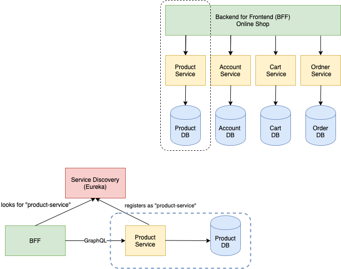

# Spring Boot Product Mircoservice

Status: Draft

## Architecture

Every Domain has its own service with database. Clients from Web use the backend for frontend which consolidates the data across all services.


### Eureka Discovery Service

The Eureka Discovery Service
([Eureka Server](https://github.com/sauterle-byteleaf/spring-boot-eureka-server)) administrate all microservices.

## Health Endpoint

[HOST]/actuator/health

## Example Queries/Mutations

### Create Product

```
mutation {
  createProduct(input: {name: "Test Product", description: "Test Description",
  price: 2.00}) {
    id
    name
    description
    price
  }
}
```

### All Products

```
{
  allProducts {
    id
    name
    description
    price
  }
}
```

### One Product

```
{
  product(id: "5e89f0aa2aa3cb562577271f") {
    id
    name
    description
    price
  }
}
```
